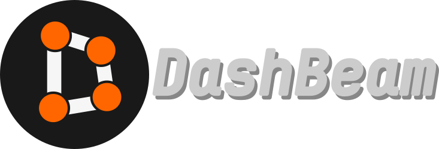

# DashBeam

## ALPHA SOFTWARE - MISSING FEATURES

DashBeam is a dashboard app for BeamNG.Drive using the OutGauge protocol.

## Getting Started

Enable OutGauge protocol in BeamNG settings. Use the IP address of the device running DashBeam. You can find your IP address in the DashBeam settings page.

## Building

Open the project in Qt Creator (Need Qt Quick 6.5 or above) and build for either desktop or Android.

## TODO

- More customizability, for example options to change fonts, colors, tachometer/speedometer range or to switch between metric and imperial units.
- Multiple dashboard types (racecar-inspired etc.)
- Main menu screen to load a dashboard type.
- Support for more/custom protocols? Will need a custom mod for BeamNG.Drive.
